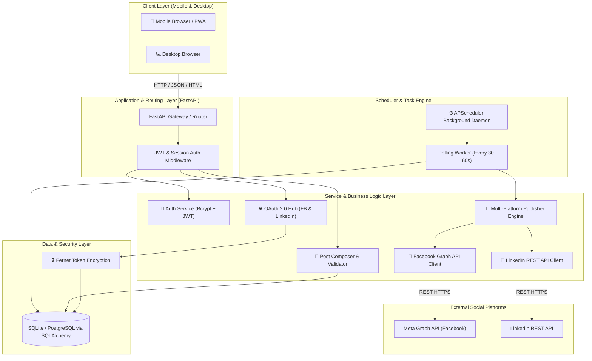
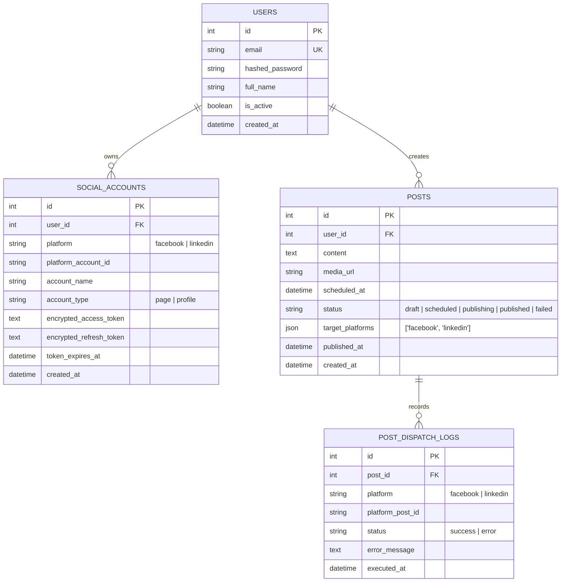
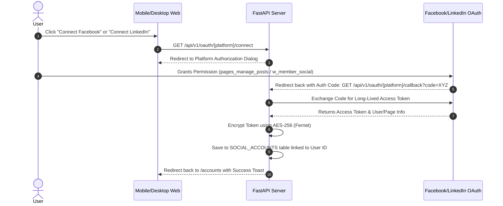
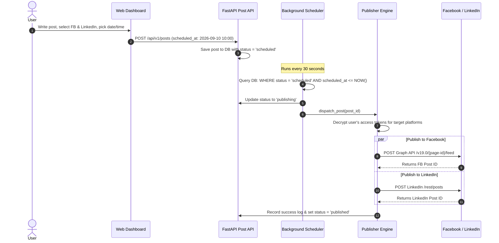

# Social Automation & Scheduling Platform — Full Engineering Architecture

A production-grade, multi-tenant SaaS engineering architecture designed for automated post scheduling and social media management across **Facebook Pages** and **LinkedIn Profiles/Pages**, accessible through a **Mobile-First Responsive Web Dashboard**.

---

## 1. High-Level System Architecture



---

## 2. Directory & Module Structure

```text
social_automation_hub/
│
├── app/
│   ├── core/
│   │   ├── __init__.py
│   │   ├── config.py             # Pydantic BaseSettings (Reads .env, app secrets)
│   │   ├── database.py           # SQLAlchemy Engine, SessionLocal & Base
│   │   └── security.py           # Password hashing (bcrypt) & Fernet Token Encryption
│   │
│   ├── models/                   # Database Entities (ORM)
│   │   ├── __init__.py
│   │   ├── user.py               # User table
│   │   ├── social_account.py     # Connected OAuth accounts (Encrypted tokens)
│   │   └── post.py               # Scheduled & Published posts
│   │
│   ├── schemas/                  # Pydantic Schemas (Request/Response DTOs)
│   │   ├── __init__.py
│   │   ├── user.py               # UserCreate, UserLogin, UserOut
│   │   ├── social.py             # SocialAccountOut, OAuthCallback
│   │   └── post.py               # PostCreate, PostUpdate, PostOut
│   │
│   ├── services/                 # Business Logic & External API Integrations
│   │   ├── __init__.py
│   │   ├── auth_service.py       # User registration, login verification, token issue
│   │   ├── facebook_service.py   # Page selection, post publishing, token exchange
│   │   ├── linkedin_service.py   # Profile/Company selection, UGC post creation
│   │   └── publisher.py          # Unified dispatcher coordinating FB & LinkedIn posts
│   │
│   ├── scheduler/                # Background Job Runner
│   │   ├── __init__.py
│   │   └── worker.py             # Periodic background poller inspecting pending posts
│   │
│   ├── routers/                  # API and View Controllers
│   │   ├── __init__.py
│   │   ├── auth.py               # /api/v1/auth (signup, login, logout)
│   │   ├── oauth.py              # /api/v1/oauth (fb-login, linkedin-login, callbacks)
│   │   ├── posts.py              # /api/v1/posts (CRUD for posts)
│   │   └── views.py              # Front-facing web pages (HTML rendering)
│   │
│   ├── static/                   # Static Frontend Assets
│   │   ├── css/
│   │   │   └── tailwind_custom.css
│   │   ├── js/
│   │   │   ├── app.js            # General UI interactions & toast alerts
│   │   │   └── post_composer.js  # Live character counters, image preview, platform selection
│   │   └── img/
│   │
│   └── templates/                # Mobile-First Responsive Jinja2 Templates
│       ├── base.html             # Shell: Desktop Sidebar + Mobile Bottom Navigation
│       ├── auth/
│       │   ├── login.html
│       │   └── register.html
│       ├── dashboard.html        # Analytics, recent activity, system status
│       ├── create_post.html      # Responsive composer with live social preview
│       ├── schedule.html         # Post queue, timeline, failed/success logs
│       └── accounts.html         # One-click Connect/Disconnect for FB and LinkedIn
│
├── docs/                         # Project Documentation & Architecture
│   ├── implementation_plan.md
│   └── walkthrough.md
│
├── tests/                        # Automated Unit & Integration Tests
│   ├── test_auth.py
│   ├── test_posts.py
│   └── test_scheduler.py
│
├── .env.example                  # Template of environment variables
├── requirements.txt              # Production & dev dependencies
├── Dockerfile                    # Containerization ready
└── main.py                       # Application Entry Point
```

---

## 3. Database Schema (Multi-Tenant Isolation)



---

## 4. Workflows & Lifecycles

### A. OAuth 2.0 Account Connection Flow


### B. Post Scheduling & Automated Dispatch Lifecycle


---

## 5. Security & Multi-Tenancy Design
1. **Multi-Tenancy Row-Level Isolation**:
   - Every database query for posts and social accounts includes `WHERE user_id = current_user.id`. Users can never read, modify, or trigger another user's accounts or posts.
2. **Access Token Encryption**:
   - OAuth tokens are never stored in plain text. A dedicated AES-256 (Fernet) encryption key (`ENCRYPTION_KEY`) in the environment encrypts tokens before writing to DB and decrypts them only at the moment of publishing.
3. **Session & Auth Management**:
   - Stateless JWT tokens passed via secure HTTP cookies or `Authorization: Bearer` headers.
   - Passwords hashed using standard `bcrypt` with salt.
4. **Resilience & Rate Limiting**:
   - Exponential backoff for API calls.
   - Distinct error logging per platform in `POST_DISPATCH_LOGS` so a failure on Facebook doesn't abort a LinkedIn post.

---

## 6. Verification & Testing Strategy

### Automated Tests:
1. `tests/test_auth.py`:
   - Registration, login, password hashing verification, JWT generation.
2. `tests/test_posts.py`:
   - CRUD on posts, validation of scheduled times, user isolation checks (User A cannot see User B's posts).
3. `tests/test_scheduler.py`:
   - Mocking Facebook & LinkedIn API responses; verifying the scheduler changes post status from `scheduled` to `published` and records log IDs.

### Manual UI Verification:
- Open dashboard in Chrome DevTools mobile responsive mode (iPhone 14 / Pixel 7 viewports) to verify the bottom navigation bar, post composer preview, and account toggles.
